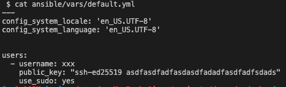
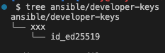

# Setup Development Machine

Automate create Linux users, copy private key and install Docker/Docker compose at remote server.

Purpose for quick setup development box.

## How to use this repository?

After clone to your machine

* Go get DigitalOcean Token
* Install terraform at local computer
* Install ansible at local computer
* Create Terraform variables _cp terraform.tfvars.example terraform.tfvars_ and edit the proper values

### Prepare configuration

Create default.yaml

```
cp ansible/vars/default.yml.example ansible/vars/default.yml
```

Example:



Then create folder same as user in default.yml and put the private key to this folder

Example:



Crete Terraform configuration

```
cp terraform.tfvars.example terraform.tfvars
```

Edit to proper values then go to next step

### Run the terraform

```
terraform init
```

and

```
terraform apply
```

or

```
terraform apply --auto-approve
```

### Destroy resources

```
terraform destory
```

or

```
terraform destory --auto-approve
```

## References

- Slug for instance type https://slugs.do-api.dev
- DigitalOcean available regions https://docs.digitalocean.com/products/platform/availability-matrix/
- Terraform DigitalOcean Provider https://registry.terraform.io/providers/digitalocean/digitalocean/latest/docs
- [$100 Credit from DigitalOcean](https://m.do.co/c/4e5606b6867d)
